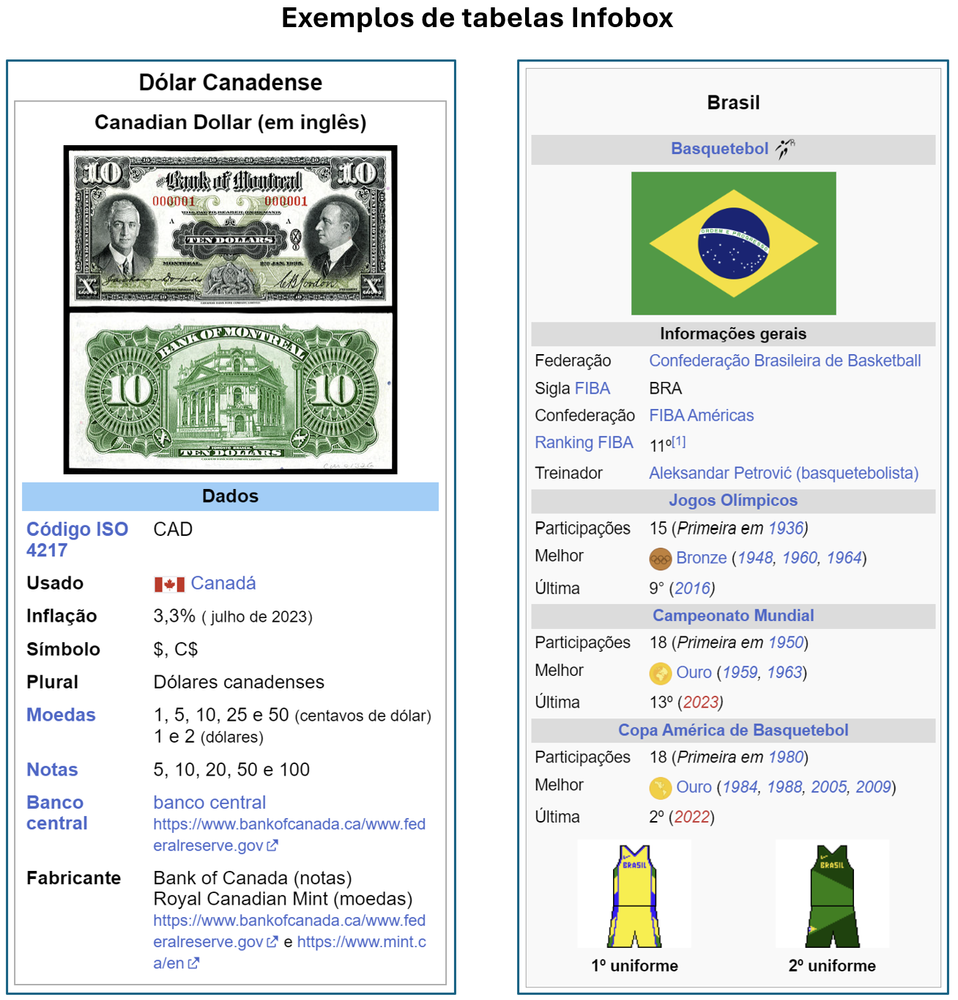

# WebScraper Wikipedia

O projeto envolve a criação de um script Python para a aquisição automatizada de dados de uma página da Wikipedia. Devido à ausência de uma API direta da Wikipedia para acesso aos dados, a solução adotada inclui o uso de Selenium para navegar até a página desejada e salvar o conteúdo HTML. Em seguida, o BeautifulSoup é empregado para extrair a tabela relevante do HTML, e os dados extraídos são processados com pandas para possibilitar análises posteriores.


## Sumário

- [WebScraper Wikipedia](#webscraper-wikipedia)
  - [Sumário](#sumário)
  - [Configuração](#configuração)
  - [Estrutura do Projeto](#estrutura-do-projeto)
  - [Uso](#uso)
  - [Contribuindo](#contribuindo)
  - [Licença](#licença)

## Configuração

1. **Clone o Repositório**:
    ```bash
    git clone git@github.com:luana-kruger/wikipedia-web-scraping.git
    cd wikipedia-data-scraper
    ```

2. **Instale os Pacotes Necessários**:
    ```bash
    pip install -r requirements.txt
    ```

3. **Baixe o Chrome**:
    - Certifique-se de ter o navegador Chrome instalado.
    - Baixe o Chrome [aqui](https://www.google.com/intl/pt-BR/chrome/).


## Estrutura do Projeto

```
wikipedia-data-scraper/
├── wikipedia_scraper.ipynb          # Notebook principal para scraping e extração de dados
├── modules/
│   └── extract_page_source.py       # Script de navegação automatizada com selenium 
├── requirements.txt                 # Lista de dependências
├── README.md                        # Documentação do projeto
└── .gitignore                       # Arquivo de git ignore
```

## Uso

1. **Execute o Notebook**:
    - Abra e execute o notebook `wikipedia_scraper.ipynb` para interagir com o processo de scraping e extração de dados.

2. **Fluxo do Script**:
    - Navega até a página principal da Wikipedia.
    - Realiza uma pesquisa com base em temas predefinidos.
    - Lida com resultados de pesquisa avançada e páginas de desambiguação.
        <p align="center">
        
        </p>

    - Extrai a tabela com a classe `infobox infobox_v2` se disponível.
        <p align="center">
        
        </p>

    - Salva os dados em um arquivo CSV.


## Contribuindo

Contribuições são bem-vindas! Se você tiver sugestões de melhorias, por favor, abra uma issue ou crie um pull request.

## Licença

Este projeto está licenciado sob a Licença MIT. Veja o arquivo [LICENSE](LICENSE) para mais detalhes.
